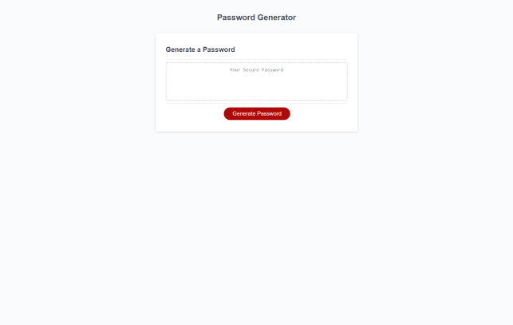
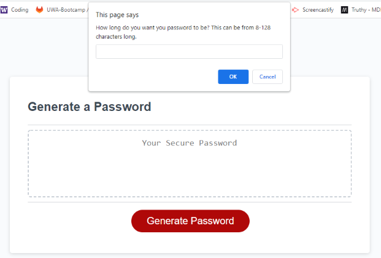
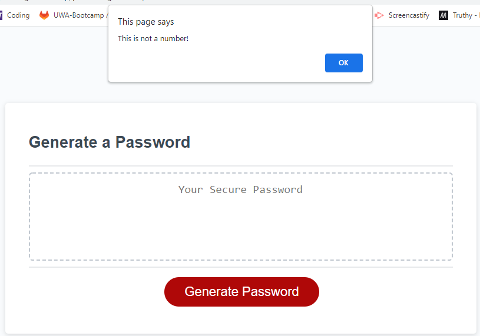
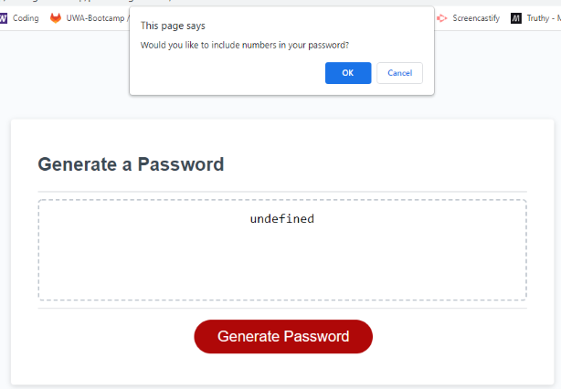
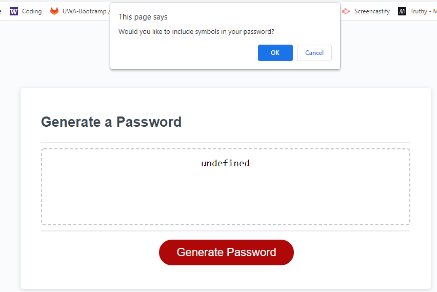
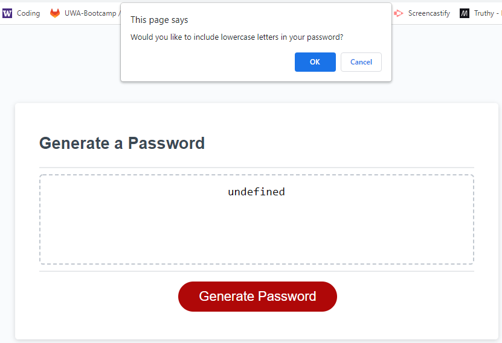
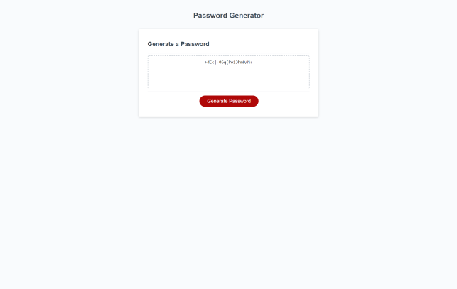

# Password Generator

## Description

This is a password generator project for the UW Coding Bootcamp.  This page uses HTML, CSS, and Javascript to create a password generator.

## Installation
Use a web browser to access the site:

https://andreahergert.github.io/passwordgenerator/

## Usage
Screenshots of website:

The user clicks on the Generate Password button:

The user will be asked how long they want their password to be:

The user will get this prompting error if they do not select between 8-128:

However, if the user selects a number in the 8-128 range, they are taken to a prompt asking if they would like to include numbers in their password:

The user is then asked if they would like to include symbols in their password:

The user is then asked if they would like to include lowercase letters in their password:

The user is then asked if they would like to include uppercase letters in their password:

A password is then generated on the page for the user:

## Credits
Initial HTML, CSS, and a very short Javascript file provided by the UW coding bootcamp.  Added Javascript to generate a password was included by Andrea Hergert.

## License
MIT License